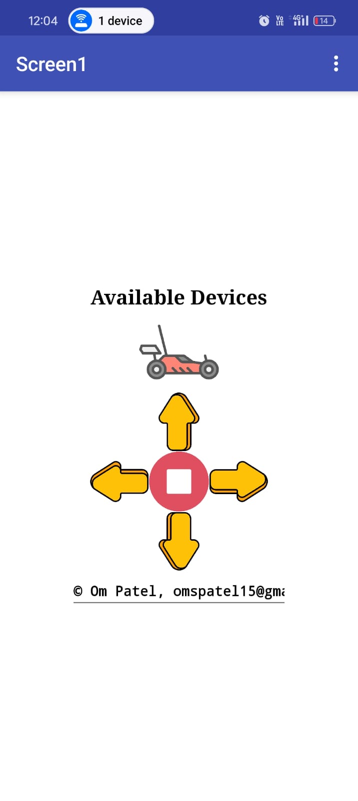
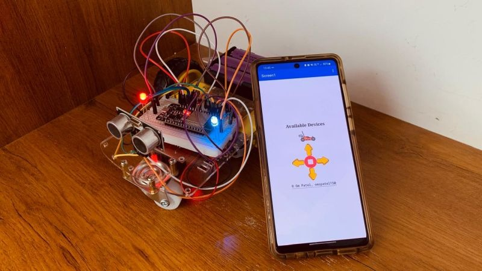
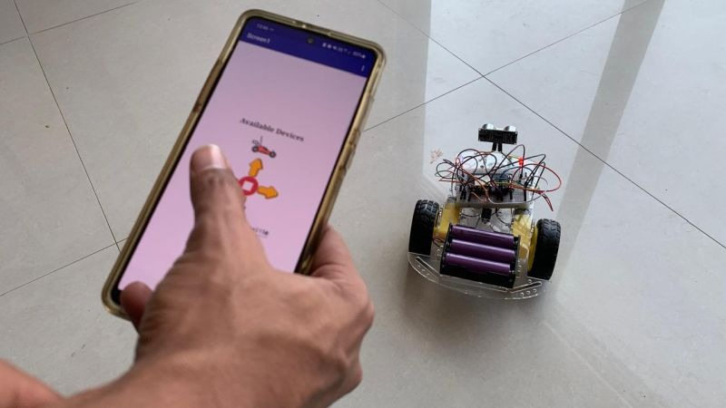

# 🚗 ESP32 Bluetooth Controlled Car  

Welcome to the official guide for the **ESP32 Bluetooth Controlled Car**.  
This project demonstrates wireless communication between a smartphone and an ESP32 microcontroller via Bluetooth, enabling real-time control of a robotic car’s movements. The car is powered by DC motors driven through a motor driver and is designed as a fun, hands-on embedded systems and robotics project.  

---

## Table of Contents  

1. [Project Overview](#project-overview)  
2. [Hardware Requirements](#hardware-requirements)  
3. [Software Requirements](#software-requirements)  
4. [Circuit Connections](#circuit-connections)  
5. [Repository Structure](#repository-structure)  
6. [Step-by-Step Setup Guide](#step-by-step-setup-guide)  
7. [Control Commands](#control-commands)  
8. [Demo](#demo)  
9. [Troubleshooting](#troubleshooting)  

---

## Project Overview 

The project consists of the following components:  

- **ESP32 Microcontroller**: Handles Bluetooth communication and motor control logic.  
- **Motor Driver (L298N / L293D)**: Interfaces ESP32 with DC motors.  
- **Smartphone**: Acts as the controller, sending Bluetooth commands to the ESP32.  

The ESP32 receives directional commands (`F`, `B`, `L`, `R`, `S`) from the phone and drives the motors accordingly.  

---

## Hardware Requirements  

- ESP32 Development Board  
- Motor Driver (L298N)  
- 2 DC Motors with Wheels  
- Car chassis  
- Battery pack (Li-ion) 3S
- Jumper wires and connectors  

---

## Software Requirements

- ESP-IDF / PlatformIO (or Arduino IDE if preferred)    
- **Custom Android APK** (provided in `/App/`) to control the car via Bluetooth   

---

## Circuit Connections  

- ESP32 GPIO **13** → Motor Driver IN1 (Motor A forward)  
- ESP32 GPIO **12** → Motor Driver IN2 (Motor A backward)  
- ESP32 GPIO **14** → Motor Driver IN3 (Motor B forward)  
- ESP32 GPIO **25** → Motor Driver IN4 (Motor B backward)  
- *(Optional)* ESP32 GPIO **27** → Motor Driver ENA (PWM speed control for Motor A)  
- *(Optional)* ESP32 GPIO **26** → Motor Driver ENB (PWM speed control for Motor B)  
- Motor Driver OUT1/OUT2 → Motor A  
- Motor Driver OUT3/OUT4 → Motor B  
- Battery → Motor Driver + ESP32 (with common GND)  

## Repository Structure  

```
ESP32-Bluetooth-Car/
│── Code/              # ESP32 firmware (bluetooth_car_esp.ino)
│── App/               # Android APK
│── Images/            # Pictures of the car
│── README.md          # Project documentation
```

---
## Mobile App  

To make controlling the car easy, this project includes a **custom Android application** (`ESP32CarController.apk`).  

###  Features  
- Clean UI with on-screen buttons for **Forward, Backward, Left, Right, Stop**  
- Connects directly to the ESP32 over Bluetooth  
- Real-time response with minimal latency  
- Lightweight and easy to install  

###  Installation Steps  
1. Locate the `ESP32CarController.apk` file inside the `/App/` folder of this repository.  
2. Transfer the APK to your Android phone.  
3. Enable *Install from Unknown Sources* (if required in your phone’s settings).  
4. Tap on the APK file and install it.  
5. Open the app and pair it with your ESP32 device (`ranger`).  

###  Usage  
- Open the app.  
- Pair your phone with the ESP32 via Bluetooth.  
- Use the on-screen control buttons to drive the car.  

 


---

## Step-by-Step Setup Guide  

1. **Upload Firmware to ESP32**  
   - Open your chosen IDE (ESP-IDF / PlatformIO).  
   - Compile and upload the firmware in `/Code/`.
     
3. **Install the Android App**  
   - Follow the [Mobile App](#mobile-app) section above.
     
2. **Pair Smartphone with ESP32**  
   - On your phone, search for Bluetooth devices.  
   - Pair with `ESP32_BT`.  

3. **Send Control Commands**  
   - Open a Bluetooth terminal app.  
   - Send characters (`F`, `B`, `L`, `R`, `S`) to move the car.  

---

## Control Commands  

- `F` → Forward  
- `B` → Backward  
- `L` → Left  
- `R` → Right  
- `S` → Stop  

---

## Demo  




---

## Troubleshooting  

- **Car not responding?** Ensure Bluetooth is paired and correct COM port/device is selected.  
- **Motors not moving?** Double-check wiring between ESP32 and motor driver.  
- **Weak movement?** Battery might need charging or replacing.  

---

  
